# 数据仓库项目文档

> 1752058  姜其升		1753731  陈    东		1753948  张    尧

[TOC]

## 项目简介

本项目数据来源自Snap的文本文件和Amazon网站。我们基于斯坦福大学中的[亚马逊商品](http://snap.stanford.edu/data/web-Movies.html)评论数据，利用爬虫技术爬取了二十多万的产品信息数据，通过**分词后基于文本相似度的分组**比较合并相同产品的电影得到数十万的电影信息，并通过**基于IMDB电影评论数据集的Keras自然语言处理**得到电影评论的情感倾下。并通过搭建Neo4j图数据库、MySQL关系型数据库与Hive分布式数据库对数据进行存储、分析及实现功能，同时对于部分功能需求针对这三种数据库进行效率对比分析以及存储和查询上的优化。

## MySQL

MySQL是时下使用率最高的几款关系型数据库之一，且其体积相较其他关系型数据库更小巧且性能不输大型关系型数据库。关系型数据库是我们最常接触也是在对数据进行存储时会最先想到的数据库类型。我们想要借助关系型数据库以及行式存储对我们的数据进行存储，并通过对应的数据库操作对存储对数据进行分析/查询，实现我们对应的目的。

### 存储模型

在本项目中我们选择具有冗余的星型模型作为我们关系型数据库的存储模型。星型存储模型是反规范化的数据，数据在数据库内部是组织好的，存在冗余以提高查询效率。相比之下，雪花模型使用的是规范化的数据，在存储时存储没有的冗余数据，规范化存储数据同时也带来查询时间上的消耗，其查询更新速度会慢于星型存储模型。考虑到查询性能的优化。所以我们选用了星型模型。我们的数据库设计了事实表和维度表，对于大量存在的事实表与维度表的多对多关系，我们使用桥接表进行桥接表。同时考虑到电影的信息完整性，我们将演员和导演也在电影事实表中进行存储，来减少查询时间。

我们在时间维度表中存储了季度、星期等信息，以加快查询；在分数维度表中存储了高于分数或低于分数的信息，以加快查询，并在必要的键上添加索引。


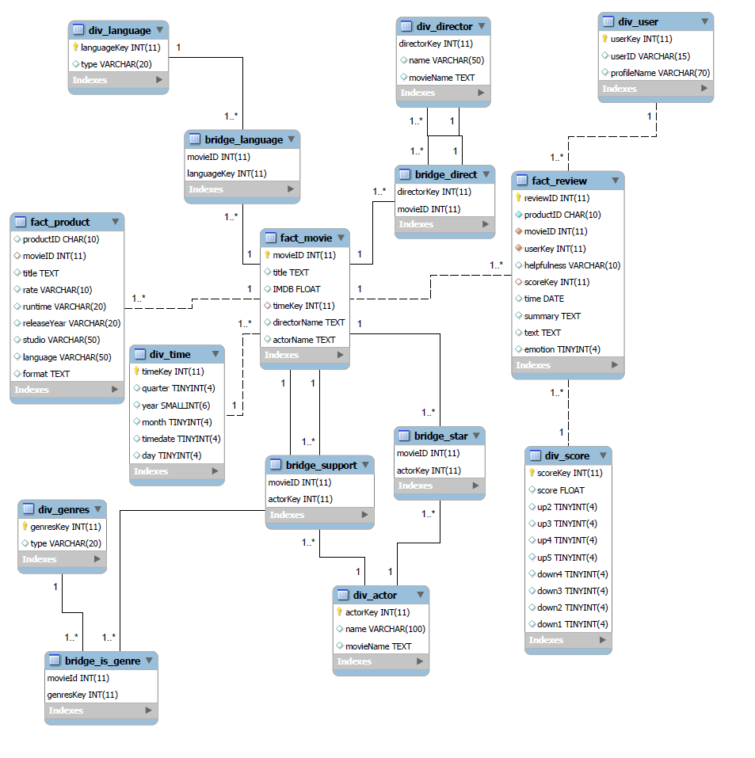

### 优化方案：

#### 1、字段数据类型：

数字的主键用int存储，而不是用字符类型；本身就是字符类型作为唯一标识的比如productID，评论者ID，我们给他们一一对应一个int的ID。

而对于有些取值范围很小的数值，比如年月日，情感（1和0），我们可以用tinyint来存储。

#### 2、各种冗余存储。

​		在演员维度表中，不仅存储演员的信息，还存储了这个演员关联（参演）的电影的信息，而不是通过join去query一个演员演过的电影。

​		在时间维度表中，之前不仅存储了完整的时间，还在此存储了按季度、年月日、星期等信息的时间。

​		在导演维度表中，不仅存储导演的信息，还存储了这个导演关联（参执导）的电影的信息，而不是通过join去query一个演员演过的电影。

​		在电影事实表中，不仅存储电影的基本信息，还存储了这个电影的导演、演员信息，而不是通过join去query一个电影关联的人。

```sql
SELECT * FROM fact_movie natural join bridge_direct natural join div_director WHERE directorKey = 3453;
```

| 采用冗余字段直接查 | 上述join查询 |
| ------------------ | ------------ |
| 241ms              | 5s114ms      |

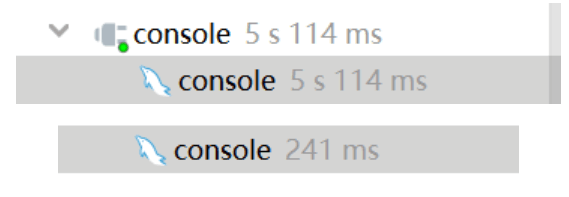

#### 3、索引：

​		作为数据仓库系统，没有增删改，只有查，因此不用考虑索引维护的开销和索引，对主键和join的连接键增加索引。

对于需要索取范围的列的查询，我们尝试无索引、升序索引、降序索引监测速度。

```
SELECT * FROM movie.test WHERE time < 90 GROUP BY imdb;
```

| 升序索引 | 降序索引 | 无索引 |
| -------- | -------- | ------ |
| 103ms    | 121ms    | 124ms  |

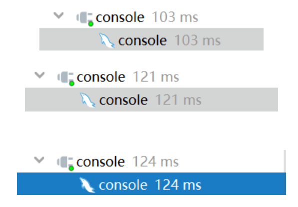

## Hive

Hive首先有很多其他数据库所不具有的优点，如扩展性和容错性，本项目我们选择hive来处理一部分数据主要是作为MySQL数据库的对照。针对我们项目的百万级的数据量来对比分析关系型数据库和分布式数据库在数据量较大时的性能优劣性，以此窥见数据仓库对比于数据库的所展现出来的优点。同时对于项目中的部分功能需求组合采用hive与其他数据库分治的方式，来实现复杂的功能需求，以此来学习工程中数据仓库与普通数据库结合的实现方法。而由于数据量及需求的限制，我们只可窥见数据仓库其作用的冰山一角，希望藉此加深我们对数据仓库的理解。


### 存储模型

Hive存储模型采用与Mysql相同的带有冗余的星型模型。

### 查询优化

#### 存储格式优化策略

##### 简介

Hive拥有多种文件存储格式：如TextFile、SequenceFile、RCFile、ORCFile等等。具体介绍如下：

**TextFile**每一行都是一条记录，每行都以换行符结尾。数据不做压缩，磁盘开销大，数据解析开销大。可结合Gzip、Bzip2使用（系统自动检查，执行查询时自动解压），但使用这种方式，hive不会对数据进行切分，从而无法对数据进行并行操作。

**SequenceFile**是Hadoop API提供的一种二进制文件支持，其具有使用方便、可分割、可压缩的特点。支持三种压缩选择：NONE, RECORD, BLOCK。 Record压缩率低，一般建议使用BLOCK压缩。

**RCFile**是一种行列存储相结合的存储方式。首先，其将数据按行分块，保证同一个record在一个块上，避免读一个记录需要读取多个block。其次，块数据列式存储，有利于数据压缩和快速的列存取。

**ORC**文件代表了优化排柱状的文件格式。ORC文件格式提供了一种将数据存储在Hive表中的高效方法。这个文件系统实际上是为了克服其他Hive文件格式的限制而设计的。Hive从大型表读取，写入和处理数据时，使用ORC文件可以提高性能。

**Parquet**是一个面向列的二进制文件格式。Parquet对于大型查询的类型是高效的。对于扫描特定表格中的特定列的查询，Parquet特别有用。Parquet桌子使用压缩Snappy，gzip。

我们主要对最原始的TextFile格式与目前官方定义最有的ORCFile存储格式进行对比，比较二者的性能差距。

| 存储格式 | 存储方式                    | 特点                                                         |
| :------: | --------------------------- | ------------------------------------------------------------ |
| TextFile | 行存储                      | 存储空间消耗比较大，并且压缩的text 无法分割和合并 查询的效率最低,可以直接存储，加载数据的速度最高 |
| ORCFile  | 数据按行分块 每块按照列存储 | 存储空间最小；查询的效率最高 ；需要通过text文件转化来加载；加载的速度最低；压缩快,快速列存取 ,效率比RCFile高,是RCFile的改良版本 |

##### 对比实验

在数据量相同的电影事实表和评论表中进行查询。对比相同查询下耗费时间的差异和在HDFS中存储的文件的大小的差异。

- 创建不同的存储表

  ```sql
  --创建TextFile格式存储的表
  create table Fact_movie(
    title string,
    runtime int,
    IMDB float,
    rate string,
    id string
  ) row format delimited fields terminated by ','
  stored as textfile;
  ```

  ```sql
  --创建ORCFile格式存储的表
  create table Fact_movie(
    title string,
    runtime int,
    IMDB float,
    rate string,
    id string
  ) row format delimited fields terminated by ','
  stored as orc;
  ```

- 执行相同的查询语句

  ```sql
  SELECT imdb, count(*) FROM fact_movie_orc/fact_movie WHERE runtime < 90 AND runtime > 80 GROUP BY imdb;
  ```

##### 对比结果

- 存储文件大小

  TextFile

  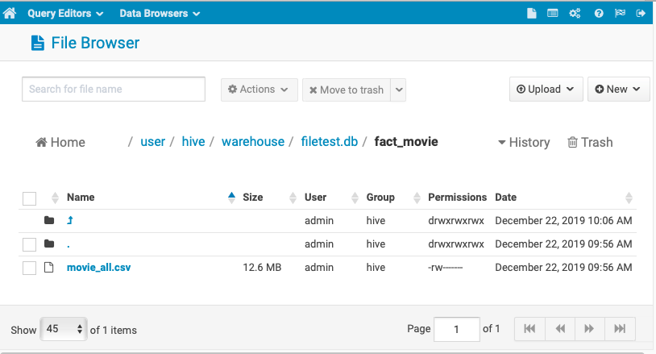

  

  ORCFile

  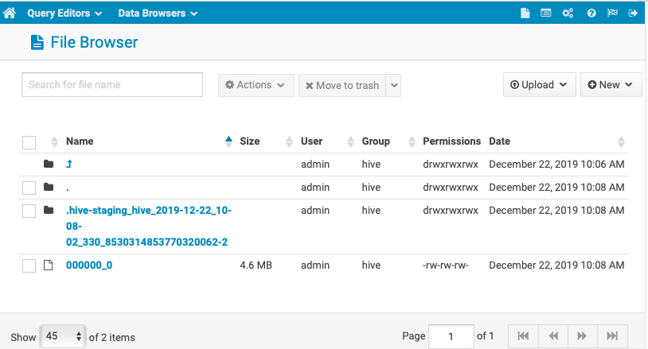

- 查询耗费时间

  TextFile

  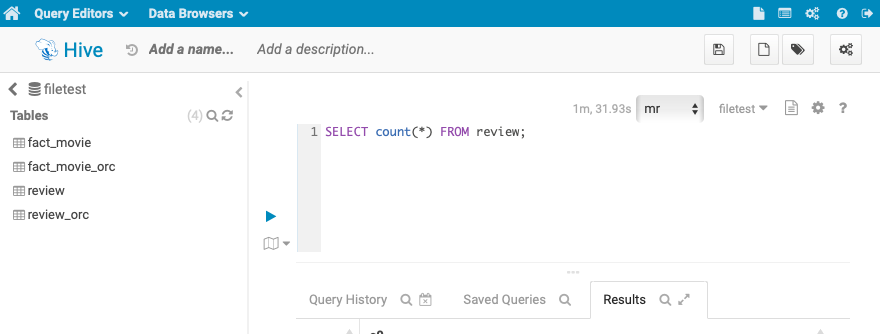

  ORCFile

  

- 实验结果

  十万级：

  | 存储方式 | 占用空间/MB | 查询耗费时间/s |
  | :------: | :---------: | :------------: |
  | TextFile |    12.6     |     36.90      |
  | ORCFile  |     4.6     |     36.119     |

  百万级：

  | 存储方式 | 占用空间 | 查询耗费时间/s |
  | :------: | :------: | :------------: |
  | TextFile | 5.1784GB |     91.93      |
  | ORCFile  | 465.76MB |     35.995     |

  

##### 实验结论

从上述实验中，我们不难看出ORC表文件明显比TextFile表文件占用空间小很多，而且对更大量的数据，压缩、优化结果将更加明显。

对于数据量较小时：至于查询性能二者差异看似不大，但ORCFile仍要优于TextFile，我们认为主要限制二者查询时间相差不大的原因有二：一、数据量较小：当前实验的数据量仍不算巨大。远小于集群内存容量，但我们仍可从此窥见ORC存储对于Text的优越性；二、计算框架限制：当前实验仍采用MapReduce计算框架来执行分布式计算，每次在执行HiveQL时都会调用MapReduce计算框架，此框架耗时巨大，因而限制了ORCFile存储格式的性能，下一步我们将对此进行改善。

对于数据量较大时,ORC文件的优越性更加明显，在占用空间和时间上均优于TextFile。因而在存储此类文本文件时，建表应选择ORCFile进行存储。

#### 计算框架优化策略

##### 简介

在上一个实验中我们发现对存储方式优化后，查询时间并没有得到很高的优化，因而我们考虑计算框架的选择。目前主要使用的的计算框架主要是HiveQL原生调用的MapReduce计算框架和基于Spark的Spark SQL（兼容HiveQL）。

Spark速度很快（最多比Hadoop MapReduce快100倍）。Spark还可以执行批量处理，然而它真正擅长的是处理流工作负载、交互式查询和机器学习。相比MapReduce基于磁盘的批量处理引擎，Spark赖以成名之处是其数据实时处理功能。Spark与Hadoop及其模块兼容。

|          |                          MapReduce                           |                            Spark                             |
| :------: | :----------------------------------------------------------: | :----------------------------------------------------------: |
|   存储   |                         使用持久存储                         |                  使用弹性分布式数据集(RDDS)                  |
|   性能   |             不需要这些数据具有实时性或近乎实时性             |                     在内存中处理一切数据                     |
|  易用性  | 没有交互模式，不过有了Hive和Pig等附加模块，采用者使用MapReduce来得容易一点 |              Spark SQL非常类似于SQL，学习成本低              |
|  兼容性  |                   MapReduce和Spark相互兼容                   |                   MapReduce和Spark相互兼容                   |
| 数据处理 | 以顺序步骤来操作，先从集群读取数据，然后对数据执行操作，将结果写回到集群，从集群读取更新后的数据，执行下一个数据操作，将那些结果写回到结果。 | 执行类似的操作，不过是在内存中一步执行。它从集群读取数据后，对数据 执行操作，然后写回到集群。 |

##### 对比实验

使用Spark有两种方式，第一种是使用Spark SQL：Spark为结构化数据处理引入了一个称为Spark SQL的编程模块。它提供了一个称为DataFrame的编程抽象，并且可以充当分布式SQL查询引擎。在现有仓库上运行未修改的Hive查询。 Spark SQL重用了Hive前端和MetaStore，为您提供与现有Hive数据，查询和UDF的完全兼容性。只需将其与Hive一起安装即可。第二种是Hive On Spark。 Hive on Spark是由Cloudera发起，由Intel、MapR等公司共同参与的开源项目，其目的是把Spark作为Hive的一个计算引擎，将Hive的查询作为Spark的任务提交到Spark集群上进行计算。通过该项目，可以提高Hive查询的性能，同时为已经部署了Hive或者Spark的用户提供了更加灵活的选择，从而进一步提高Hive和Spark的普及率。

这里采用第一种方式进行比较。在数据量相同的电影事实表中进行查询。 使用不同的计算框架进行查询对比相同查询下耗费时间的差异。具体内容同上。


##### 对比结果

| 计算框架  | 查询耗费时间/s |
| :-------: | :------------: |
|   Spark   |     20.658     |
| MapReduce |     37.87      |

##### 实验结论

由此可以看到，采用Spark的计算框架速度明显优于MapReduce。虽然没有官网宣称快5-10倍，但优化速度仍然明显，尤其是在数据量大时，Spark利用内存加速计算的能力将更加凸显。

#### 存储文件格式：

textfile orcfile

#### 计算框架：

mr spark on hive


spark on hive 界面


十万级：执行时间 分成多个job执行


总的执行时间


hive 百万级


spark 百万级


spark 执行过程


#### 优化器：

RBO：事先定义好一系列的规则，然后去遍历这些规则做优化。

缺点：基于经验，可能会偏；不可能列出全部的经验

CBO：根据所谓的代价去做优化，代价最小的执行计划就是最好的执行计划。

——解决join性能 定义代价模型

##### 开启自动转换情况下


rbo


cbo第一次


cbo第二次


cbo第三次

##### join性能


rbo


cbo

#### join：是否开启自动转换

join

map join：小表并大表


开启自动转换

不开启自动转换

## Neo4j

在现实世界中，除数据本身之外，数据与数据之间联系的重要性也是非同小可，然后传统的关系型数据库并不能很好的表现数据之间的联系，而一些非关系型数据库又不能表现数据之间的联系，但同样是NoSQL的Neo4j图数据库是以图的结构形式来存储数据的，它所存储的就是联系的数据，是关联数据本身。Neo4j是一个高性能的NOSQL图形数据库，它将结构化数据存储在网络上而不是表中。它是一个嵌入式的、基于磁盘的、具备完全的事务特性的Java持久化引擎，但是它将结构化数据存储在网络（从数学角度叫做图）上而不是表中。Neo4j也可以被看作是一个高性能的图引擎，该引擎具有成熟数据库的所有特性。

在一个图中包含两种基本的数据类型：**Nodes（节点）** 和 **Relationships（关系）**。**Nodes 和 Relationships** 包含key/value形式的属性。Nodes通过Relationships所定义的关系相连起来，形成关系型网络结构。

本次项目中希望对电影及其周边信息进行统计和分析，希望通过合理的数据模型构建以及后期的合理优化以达到良好的查询效率。

### 数据建模

根据业务需求分析，我们在neo4j中初步构建以下数据模型。演员、导演、电影、评论用户、电影发行商、电影类别、产品均可作为节点。演员节点LABEL为Actor，导演节点LABEL为Director，电影节点LABEL为Film，评论用户节点LABEL为Audience，电影发行商节点LABEL为Studio，电影类别节点LABEL为Genre，产品节点LABEL为Product。演员具有指向电影的单向关系，TYPE为STARRING以及SUPPORTING，以此表示演员主演或参演某部电影；导演具有指向电影的单向关系，TYPE为DIRECTED，表示导演指导某部电影；电影具有指向电影类别的关系，表示该电影的类别（此处考虑具有根据电影类别查询相关电影的操作，故将电影类别作为节点，而非电影节点中的属性）；产品具有指向电影的关系，表示该电影的多个版本，TYPE为VERSIONS；发行商具有指向电影的关系，表示发行商发行某部电影；评论用户具有指向电影的REVIEW关系，在REVIEW关系属性中以键值对的方式存储了电影评论的详细信息。

 

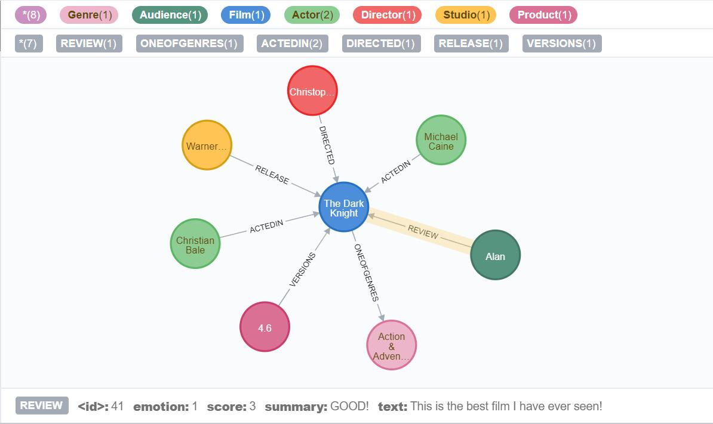 

 

​    以如上数据模型所示构建图数据库，并进行查询实验。

### 优化方案

1. **增加信息冗余，以空间换时间，可是适当提升查询效率。**将电影的主演，助演、导演、及共多少版本等信息作为电影节点属性冗余存储，当需要根据电影名称查询演员或其他相关信息时，无需再通过关系去寻找目标节点，这时可直接通过查询电影节点属性获得相关值。

2. **查询关系计数优化**。通过对业务需求的分析，我们不难发现我们经常需要统计节点上的关系数目。例如某类别电影有多少不，某导演执导了多少部电影，某演员参演了多少电影等等。通常我们会这样来写查询语句：

   ```CQL
   MATCH (n:Genre {name:‘Action & Adventure’})-[]-() RETURN count(*);
   ```

   事实上，Neo4j数据库在保存关系时会同时更新相关节点的关系计数器，该计数器保存在数据库中并和节点相关联。我们其实不需要真正读出节点上的关系来统计它们的数量，而只要从关系计数器中读取当前的数值即可。所以上述语句可修改为如下：

   ```CQL
   MATCH (n:Genre {name:‘Action & Adventure’}) RETURN size((n)-[]-())
   ```

3. **将合适的节点属性替换成以标签的形式**。在对数据进行建模的时候，我们可能偶尔会纠结某个值是作为节点属性好，还是作为标签好。事实上，当查询节点处在模式的开头的时候，在专用标签上进行匹配和使用属性索引似乎并不能看到较大的查询性能差异，但是当查询节点不在模式开头时，这一差异将会明显的体现出来。在本次项目中，我们有根据用户姓名查找他的正面评价，对此我们将用户评论从关系改为节点，并为正面评价节点增加LABEL:Positive，这样的查询效率将会高于原来查询属性值的方式。

4. **如果配置够好的话，为neo4j内存分配尽可能大。**在配置文件中neo4j的默认设置为dbms.memory.heap.initial_size=512m；dbms.memory.heap.max_size=512m，根据硬件配置，做合适的修改（最大堆内存越大越好，但是要小于机器的物理内存）

5. **对合适的数据进行拆分，即变为多个维度**。在本次项目中，在查询业务中有针对某年，某月，某季度新增电影的查询。在第一次的数据建模中，我们将电影的上映时间存储数据类型为date，虽然可对date进行解析也能达到查询目的，但如果将上映时间变为年，月，日，季度等维度，且都存在电影节点的属性中，那么在针对时间对电影进行查询时就可以实现更高的查询效率。

6. **在合适的属性上建立索引**。当 Neo4j 创建索引时，它会在数据库中创建冗余的副本，因此使用索引会占用更多的硬盘空间并减慢写入速度。因此在决定索引哪些数据时你需要进行一些权衡。

   根据上述优化，数据建模如下：

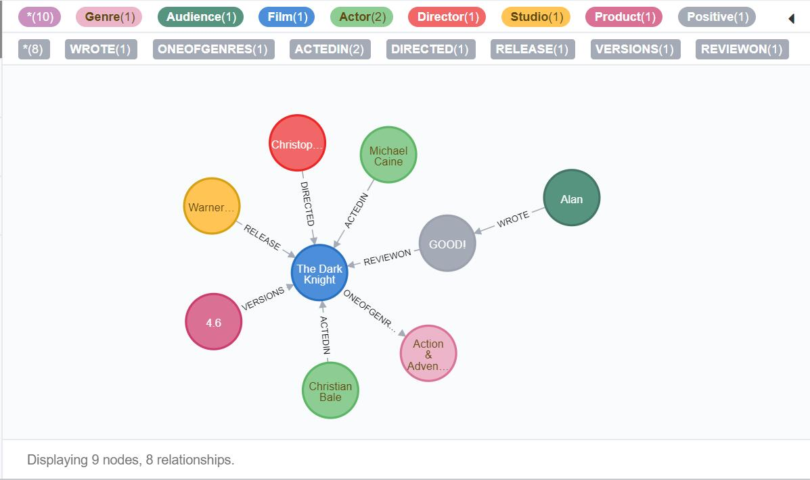


## 性能分析

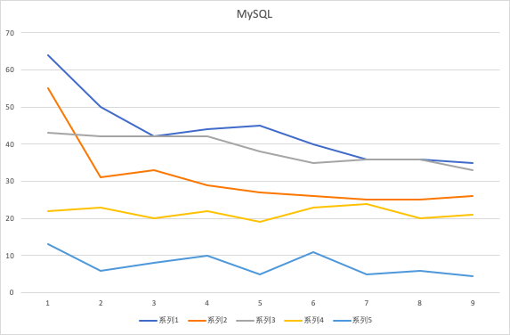

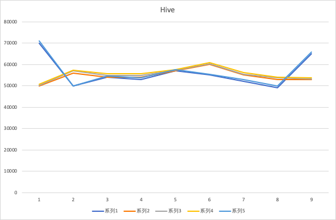

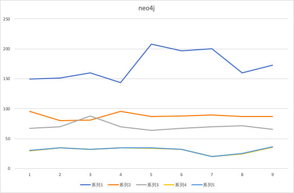

- 性能对比

  从我们对于MySQL和Hive这两种比较有可比性的数据库之间的对比来说，MySQL的执行时间基本上是远远快于Hive的执行时间的。
  首先，考虑我们在这两种数据库中执行的操作，如果对于一开始数据从文件进入数据库中这一过程忽略的话，我们整个项目执行的都是OLAP即联机分析处理操作。Hive作为一个经典的数据仓库工具，本身应该是擅长执行OLAP操作的，因此暂且认为"操作"不是造成二者执行时间差异的原因；
  其次，Hive官网有句话"Hive在大型数据集上会表现出优越的性能"，考虑到我们的项目数据集中，最多的数据集是700多万条的用户评论数据，而基本功能的实现都是操作在数据量仅有10万余条的电影数据，我们猜测是数据量限制了Hive体现其优越性。因此我们作了如下实验：在等量的数据量变化上，我们比较二者变化前后的执行的时间，得到下表

  | 数据库 | 十万级数据 | 百万级数据 |
  | ------ | ---------: | :--------: |
  | MySQL  |      211ms |   2395ms   |
  | Hive   |    36110ms |  35000ms   |

  就时间来说，很显然MySQL更胜一筹，但从增长比例来说，MySQL从211ms增长至20395ms增长约为100倍，而Hive基本保持不变，由此我们可窥见Hive在大量数据集时性能会更加优越。且MySQL在百万数据集进行```count()```等聚集操作时，速度降低更加明显。

  上述操作均是在单表查询的前提下，进行多表查询时Hive与Mysql的效率如下：

  | 数据库类型 |    时间 |
  | ---------- | ------: |
  | MySQL      |  2871ms |
  | Hive       | 44010ms |

  此现象引出了数据仓库在实际应用中的一种常见处理方式：为了提高速度而产生数据冗余。Hive中的表是很特殊的，其没有主键、外键同时库中各个表之间的冗余会很明显，这使得管理人员方便针对各种功能设计所需的信息表，这也是数据仓库作为大量数据集的OLAP最佳选择的原因之一。

- 走势变化

  由图可见，三种数据库中执行时间都是先较多然后减少最后趋于稳定，我们对其分析可能是jdbc在首次连接时需要较多时间进行网络通信，当一次连接建立后，我们并没有关闭该连接，在此基础上程序执行后续的查询才应当是其真实的操作时间。

- 功能对比

  不同的数据库，在不同的功能需求下各有优劣。

  在查询实体间的关系时，即使对于存在冗余的星型模型关系型数据库来说，在存储大量多对多的关系时，仍需要桥接表进行连接，因此在查询时可能需要多表连接查询，这明显会消耗大量时间，而对于基于relation的图形数据库Neo4j来说，类似查询正是其强项所在。

  对于neo4j而言，他有如下优点：

  - **更快的数据库操作**。存储关系较多，在关系型中中存储的话需要许多表，并且表之间联系较多（即有不少的操作需要join表）。
  - **数据更直观**。相应的SQL语句也更好写（Neo4j使用Cypher语言，与传统SQL有很大不同）。
  - **更灵活**。不管有什么新的数据需要存储，都是一律的节点和边，只需要考虑节点属性和边属性。而MySql中即意味着新的表，还要考虑和其他表的关系。数据库操作的速度并不会随着数据库的增大有明显的降低。这得益于Neo4j特殊的数据存储结构和专门优化的图算法。

  而对于传统的关系型数据库，其保持ACID的特性使其在日常数据处理中有强大的处理能力。Mysql处理的数据量都比较小，延迟很低，因而Mysql可以做在线业务。 他也具有如下优点：

  - **容易理解**：二维表结构是非常贴近逻辑世界一个概念，关系模型相对网状、层次等其他模型来说更容易理解； 
  - **使用方便**：通用的SQL语言使得操作关系型数据库非常方便； 
  - **易于维护**：丰富的完整性(实体完整性、参照完整性和用户定义的完整性)大大减低了数据冗余和数据不一致的概率； 
  - **支持SQL**，可用于复杂的查询。

  但传统的关系型数据库在面对高并发、海量数据的高效读写、高扩展性和可用性是就显得无能为力了。正如我们在上面的性能对比实验中可以看到，在面对百万级数量时，MySQL的查询速度明显下降，查询时间明显增强。

  分布式的数据库的出现则是为了应对日益增长的数据量以及大量数据处理。Hive是存储在分布式文件系统HDFS上的，扩展性很好，Hive的规模大、延迟高。因而Hive多用于离线的分析业务。他的优点是：

  - 高性能并发读写
  - 海量数据访问
  - 可扩展性的分布式

  但他也具有开启服务缓慢、在数据量小时耗时过长、对系统性能要求较高等缺点。

  | 数据库       | Hive              | Mysql    |
  | ------------ | ----------------- | -------- |
  | 查询语言     | HQL               | SQL      |
  | 数据存储位置 | HDFS              | Local FS |
  | 数据格式     | 用户自定          | 系统决定 |
  | 数据更新     | hive(0.14) 后支持 | 支持     |
  | 索引         | 无                | 有       |
  | 执行         | MapReduce         | Executor |
  | 执行延迟     | 高                | 低       |
  | 可扩展性     | 高                | 低       |
  | 数据规模     | 大                | 小       |

## 项目总结

对于本项目最终构建的查询统计程序，使用Java Web框架搭建，使用**JSP+Sevlert**构建，并基于**sementicUI**进行前端开发。

在数据库的选择上，我们使用了Mysql，hive以及Neo4j三个不同的数据库进行横向纵向比对，通过实现一定的基本功能搜索以及多表联查，统计他们的性能，查询时间等数据并进行相应的分析，对于常见的查询及统计功能进行了实现，并针对不同的数据库类型，进行了不同方面的优化，对于不同数据库的优劣势有了更为清晰的了解。

以及对于数据仓库和数据库都有了更深的理解和体悟。了解到了数据库是面向事务的设计，一般存储在线交易数据，设计是尽量避免冗余，一般采用符合范式的规则来设计，为捕获数据而设计；数据仓库是面向主题设计的，一般存储历史数据，有意引入冗余，采用反范式的方式来设计，为分析数据而设计，它的两个基本的元素是维表和事实表。在项目过程中，我们将上课学到的知识应用到实践中，尝试了雪花，星型等不同的存储结构，针对不同的数据库类型，进行了不同方面的优化，并根据自己的项目实情选择了最适合我们的项目存储结构。针对不同的实验现象，我们也通过网络等资源来进行辅助学习，帮助我们更好的了解不同数据库以及其不同的存储，读取等方式。同时对于大文本文件的处理、ETL系统的使用以及数据收集、数据清洗、情感分析等方面也有了一定的了解。

## 参考资料

https://www.cnblogs.com/MOBIN/p/5702580.html

[spark 与mr](https://blog.csdn.net/Dr_Guo/article/details/51417203)